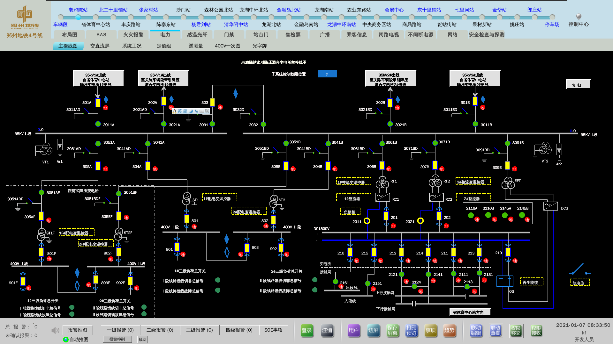

个人项目经验包括参加工作后所有涉及的程序. 
基于职业道德, 不会公布代码, 只采用软件截图+描述的方式说明.

## 富泰华有限公司 
> 公司为工厂代工性质, 所涉及软件偏向于自动化

- 自动化软件测试解析软件(Objective-C)
- 车间控制监控软件(Objective-C 、Perl)
- AGV自动导航小车中控软件(Objective-C)
- 车间自动上料自动化中控软件(Objective-C、Mysql、Socket)
- 自动化控制软件(C++)

## 深圳燕麦科技有限公司
> 公司为测试治具和非标自动化

- 手机软版测试上位机(C++ 、OpenCV、Qt、工业相机)
- 非标软板测试自动化 (Java、Socket)
- iphone气压传感器测试上位机(自定义协议、Objective-C、C++、shell、Socket)
- 手机软板金手指对位测试(Objective-C、OpenCV、shell)
- iphone气压传感器测试上位机二代(自定义协议、Objecitve-C、C++)
- 公司版本管理工具搭建(gitlab)

## 郑州辉煌科技有限公司
> 公司为针对地铁/高铁做监控系统 (主要参与郑州14号线、郑州3号线、郑州4号线、洛阳1号线)

- 郑州14号线、郑3号线、郑州4号线、洛阳1号线地铁监控系统,介面部份开发(Qt、C++)

  

  

  

  

  

  

  

- 监控系统报表程序(Qt、C++、Mysql、Oracle)

- 公司内容查询工具(cmd、Qt、C++)

- 数据库建表脚本(cmd, shell)
- 

- 公司帮助系统搭建(dokuwiki、php、Apache)

- 公司版本管理统搭建(gitblit、svn)

